<div align="center">

# SentinelWell AI
### AI-Based Predictive Personnel Stress & Welfare Monitoring System for Uniformed Forces

**Smart India Hackathon (SIH) 2026 Submission**  
**Problem Statement ID:** `26186` &nbsp;|&nbsp; **Category:** Software &nbsp;|&nbsp; **Theme:** MedTech / BioTech / HealthTech  
**Issuing Organization:** Ministry of Home Affairs (MHA), Central Reserve Police Force (CRPF)

[](https://sih.gov.in/)
[](https://sih.gov.in/)
[](https://sentinel-well-mind.vercel.app/login)
[](https://react.dev/)
[](https://www.typescriptlang.org/)
[](https://fastapi.tiangolo.com/)
[](https://lightgbm.readthedocs.io/)
[](https://aiven.io/)

<br />

<p align="center">
  <b>A proactive, explainable, and privacy-preserving welfare intelligence system designed to detect early indicators of operational stress, fatigue, and burnout across high-strain uniformed services—without psychiatric stigmatization or disciplinary tracking.</b>
</p>

[Explore Live Demo](https://sentinel-well-mind.vercel.app/login) &nbsp;•&nbsp; [System Architecture](#system-architecture) &nbsp;•&nbsp; [Key Modules](#key-modules--capabilities) &nbsp;•&nbsp; [Local Setup](#installation--local-setup) &nbsp;•&nbsp; [Team](#team--attribution)

<br />

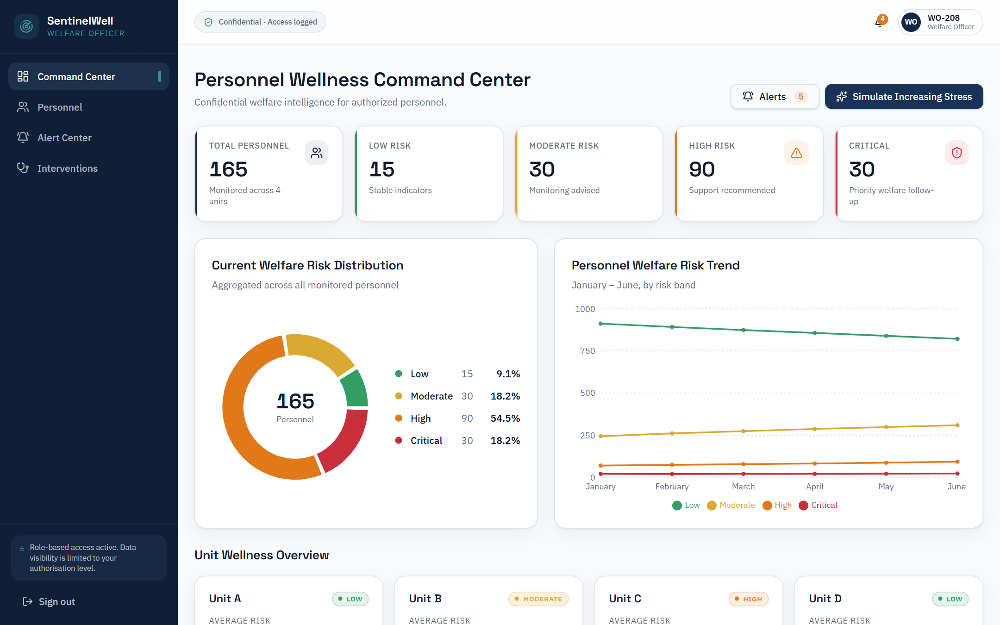

</div>

---

## Executive Summary

Uniformed personnel serving in **Central Armed Police Forces (CRPF, BSF, CISF, ITBP, SSB)**, the **Indian Armed Forces**, and **State Police forces** face rigorous operational conditions—hazardous duty, prolonged postings away from families, disrupted circadian rhythms, and recurring night deployments.

Today, stress identification across security forces remains **fundamentally reactive**, dependent on ad-hoc manual observation after critical burnout or incidents occur. 

**SentinelWell AI** transforms this paradigm from **reactive reaction to proactive prevention**. By integrating objective operational indicators (consecutive duty days, night shifts, deployment duration, leave denial patterns) with voluntary self-reported wellness check-ins, our platform computes a 4-band **Welfare Risk Index** backed by **Explainable AI (SHAP)**. It empowers welfare officers to initiate timely rest cycles and counseling while strictly safeguarding personnel confidentiality.

---

## Problem Statement (PS ID: 26186)

* **Title:** AI-Based Predictive Personnel Stress and Welfare Monitoring System for Uniformed Forces
* **Organization:** Central Reserve Police Force (CRPF), Ministry of Home Affairs (MHA)
* **Category:** Software
* **Theme:** MedTech / BioTech / HealthTech
* **Target Workforces:** CAPFs (CRPF, BSF, CISF, ITBP, SSB), Indian Armed Forces, State Police Organisations, Disaster Response Units (NDRF/SDRF), and emergency responders.

### The Ground Reality & Challenges
1. **Late Intervention:** Conventional stress identification relies on subjective peer reporting, frequently resulting in support arriving only after severe psychological distress or operational breakdown.
2. **Mental Health Stigmatization:** Personnel often fear reporting psychological strain due to concerns regarding career progression, peer perception, or administrative stigmatization.
3. **Black-Box Skepticism:** Traditional algorithmic scoring lacks interpretability, making commanders hesitant to act on unexplained alerts.
4. **Data Privacy & Operational Security:** Welfare tracking must never devolve into punitive surveillance or compromise individual personnel records.

---

## The SentinelWell Solution & Ethical Philosophy

> **Core Philosophy:** *"Support, Not Surveillance. Welfare, Not Diagnosis."*

SentinelWell AI is deliberately architected with strict ethical safeguards:
* **No Diagnostic Medical Labeling:** The platform never outputs psychiatric diagnoses or stigmatizing labels like *"mentally unfit"*. It evaluates organizational stress indicators and assigns **Welfare Risk Levels** (`Low`, `Moderate`, `High`, `Critical`).
* **Role-Based Air-Gapping:** 
  * **Commanders** view anonymized, aggregated unit readiness trends (e.g., Company/Battalion burnout index) without accessing individual personal profiles.
  * **Welfare Officers** hold confidential, one-on-one triage views with explainable driver breakdowns.
  * **Personnel** retain ownership over their data with granular consent toggles and complete access audit transparency.
* **Transparent Decision Support:** Powered by **TreeExplainer SHAP**, every alert pinpoints the exact top 3 primary trigger indicators (e.g., *14 consecutive duty days*, *8 night shifts in 30 days*, *under 5 hours average sleep*).

---

## Key Modules & Capabilities

### 1. Welfare Officer Command Center & Real-Time Triage
The operational command center for authorized welfare officers, presenting the complete picture from macro distributions down to individual actionable records.

<div align="center">
  <p align="center"><b>Command Center KPIs & Risk Distribution</b></p>
  
  <br /><br />
  <p align="center"><b>High-Risk Personnel Triage Roster & Unit Breakdown</b></p>
  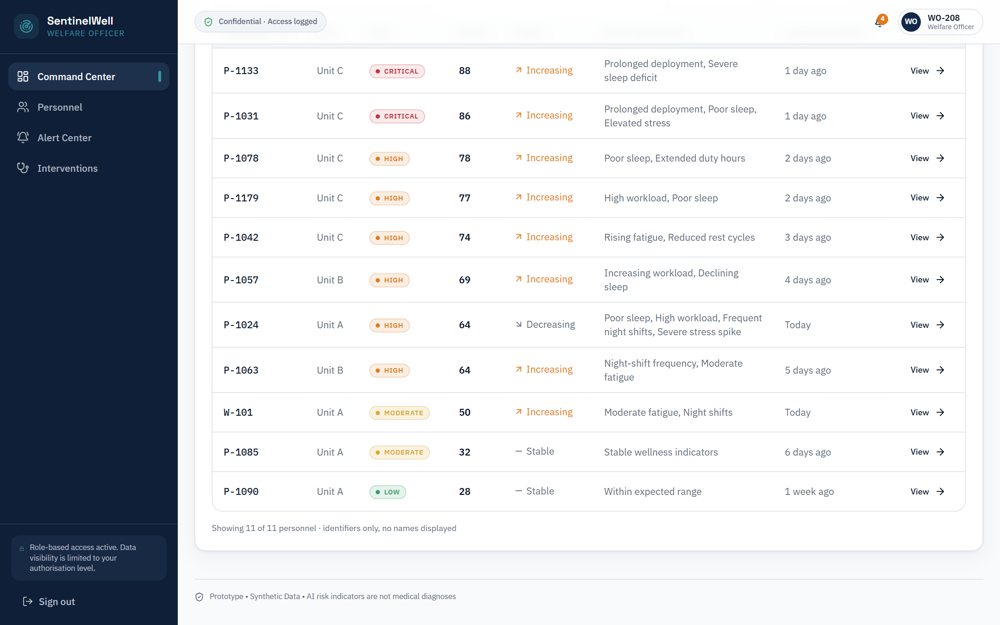
</div>

* **Full Page Triage Stack:**
  * **Top Metrics & Risk Distribution:** High-level summary (165 Monitored Personnel, 15 Low, 30 Moderate, 90 High, 30 Critical) with 6-month historical risk trend.
  * **Unit Wellness Overview:** Rapid comparative cards for Unit A (Low - 31), Unit B (Moderate - 54), Unit C (High - 71), and Unit D (Low - 27).
  * **High-Risk Personnel Master Table:** Complete triage roster showing Personnel ID (`P-1133`, `P-1031`, `P-1078`, `P-1179`, `P-1042`, `P-1024`, etc.), risk scores (up to 88 Critical), trend trajectories, main stress indicators (e.g., prolonged deployment, severe sleep deficit), and direct action links.

---

### 2. Personnel Risk Radar & Explainable AI (XAI)
A complete, multi-tiered profile view providing full explainability into individual risk metrics, longitudinal trends, and supportive action pathways.

<div align="center">
  <p align="center"><b>Personnel Risk Radar & SHAP Factor Breakdown</b></p>
  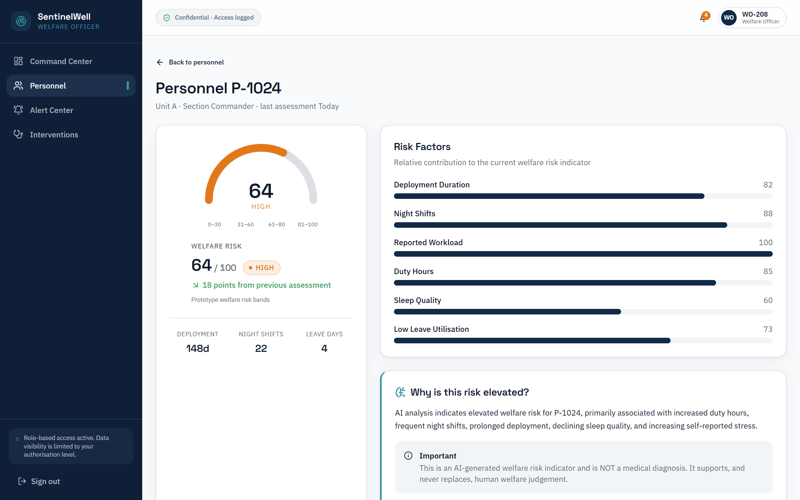
  <br /><br />
  <p align="center"><b>Longitudinal Trends & Recommended Welfare Actions</b></p>
  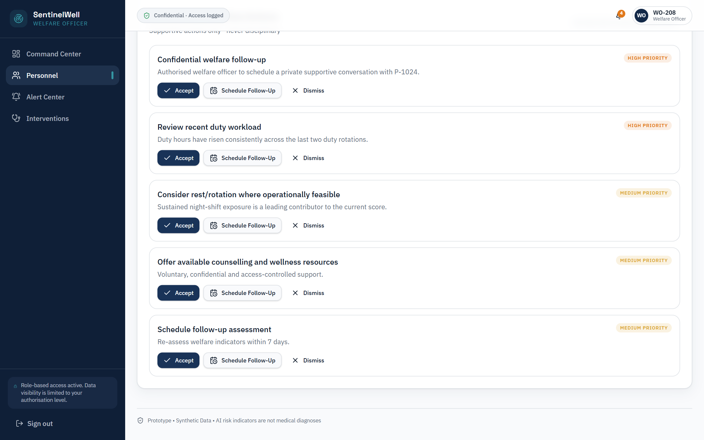
</div>

* **Comprehensive Welfare Breakdown:**
  * **Continuous Risk Gauge:** Clear 0–100 index with trend differential (`64 / 100 HIGH · ↘ 18 pts from previous assessment`).
  * **Operational Stress Factor Impacts:** Relative contributions: Deployment Duration (82%), Night Shifts (88%), Reported Workload (100%), Duty Hours (85%), Sleep Quality (60%), Low Leave Utilisation (73%).
  * **Recent Longitudinal Trends (6-Month Graphs):** Independent telemetry graphs tracking Stress trajectory, Sleep quality, Perceived Workload, Monthly Duty Hours (200h $\rightarrow$ 260h), and composite Risk Score.
  * **Recommended Welfare Actions Hub:** Direct one-click triage workflows:
    * *Confidential welfare follow-up* (Schedule private supportive conversation)
    * *Review recent duty workload* (Adjust rotation cycles)
    * *Consider rest/rotation where operationally feasible*
    * *Offer available counselling and wellness resources*
    * *Schedule follow-up assessment within 7 days*

---

### 3. Proactive Welfare Interventions & Live Alert Center
Enables welfare officers to transition directly from automated risk detection to organizational care.

<div align="center">
  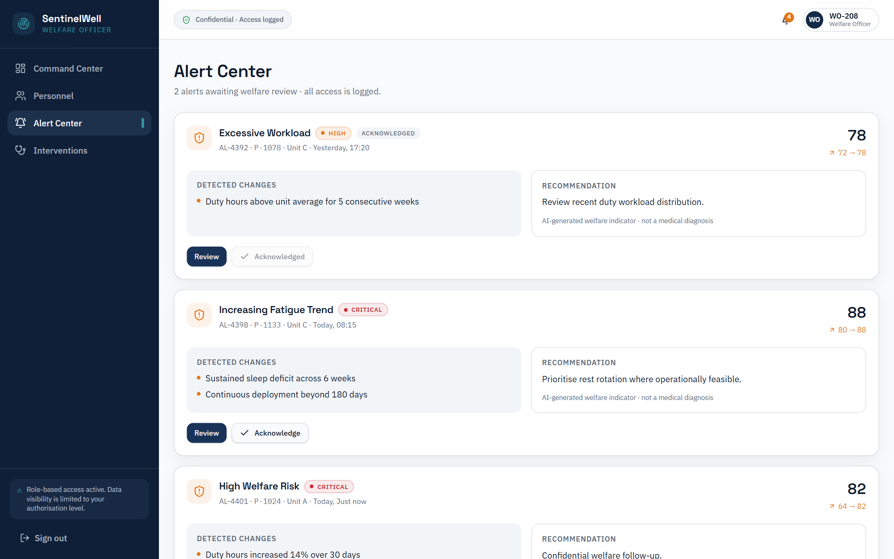
  &nbsp;
  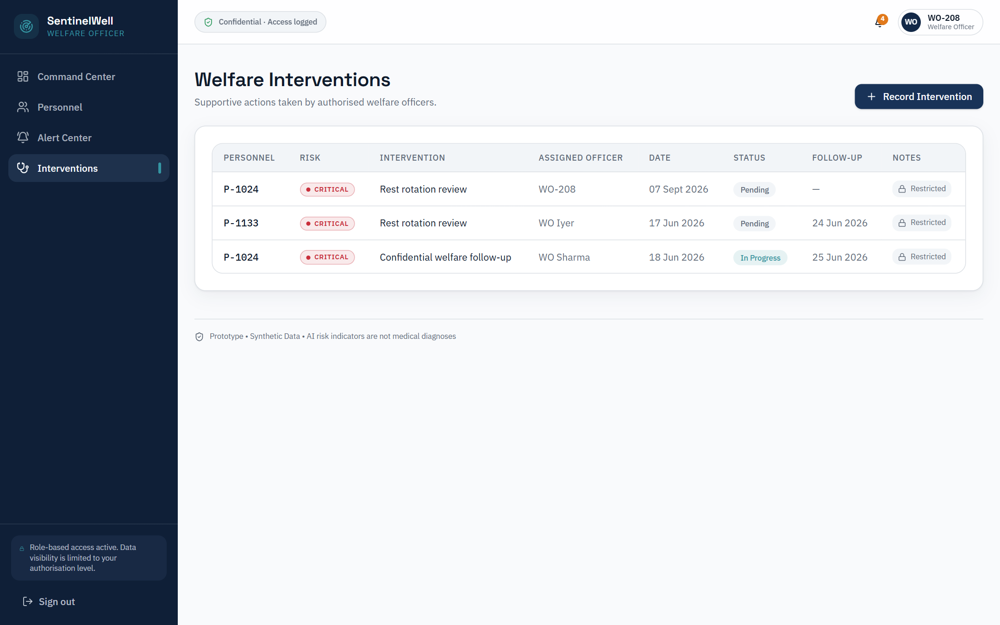
</div>

* **Live Alert Center:** Real-time stream of detected changes, such as *Excessive Workload* (Duty hours above unit average for 5 consecutive weeks) and *Increasing Fatigue Trend* (Sustained sleep deficit across 6 weeks, continuous deployment beyond 180 days).
* **Intervention Tracking:** Structured tracking of rest cycle approvals, roster re-allocations, and follow-up milestones.

---

### 4. Commander Battalion Overview & Unit Analytics
Tailored for senior leadership and battalion commanders to assess force readiness while strictly safeguarding individual privacy.

<div align="center">
  <p align="center"><b>Battalion Readiness & Workload Distribution</b></p>
  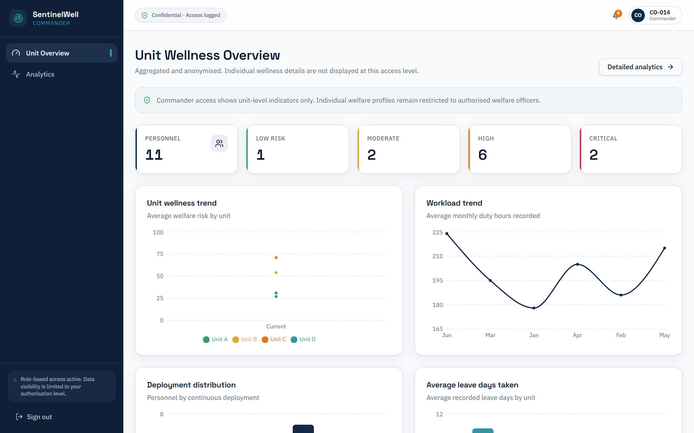
  <br /><br />
  <p align="center"><b>Fatigue Indicators & Operational Insights</b></p>
  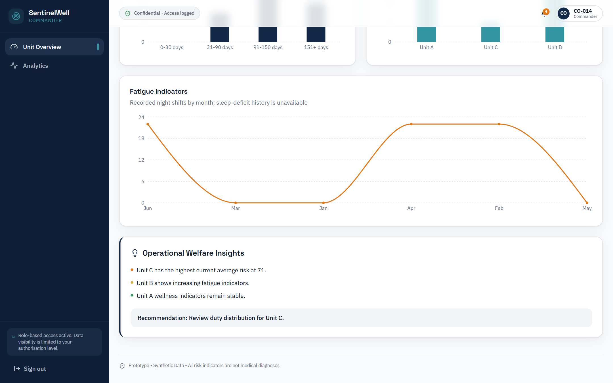
</div>

<div align="center">
  <p align="center"><b>Battalion Longitudinal Analytics & Leave Correlation</b></p>
  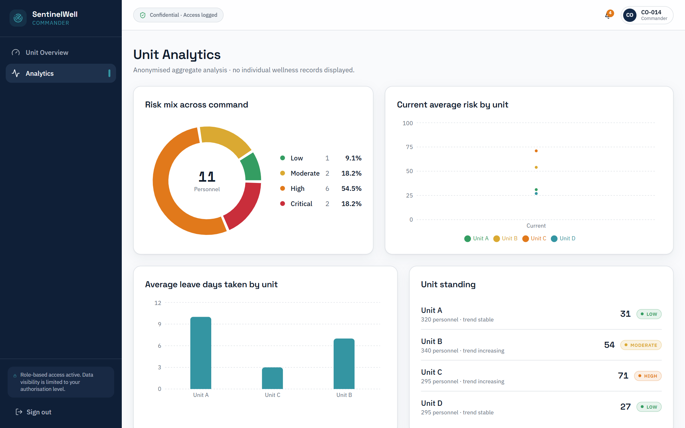
</div>

* **Full Page Command Stack:**
  * **Aggregate Unit Overview:** Shows unit-level standing without exposing individual medical or personal details.
  * **Deployment Duration & Leave Utilization:** Identifies units with high continuous deployment (>90-150 days) versus average leave days taken.
  * **Fatigue Indicators Graph:** Recorded night shifts mapped against monthly duty workload trends.
  * **Operational Welfare Insights:** Automated recommendations (e.g., *"Unit C has the highest current average risk at 71. Recommendation: Review duty distribution for Unit C"*).

---

### 5. Personnel Self-Check, Longitudinal Trends & Support
A voluntary, confidential mobile-responsive portal for jawans and officers.

<div align="center">
  <p align="center"><b>Personnel Wellness Portal & Check-In</b></p>
  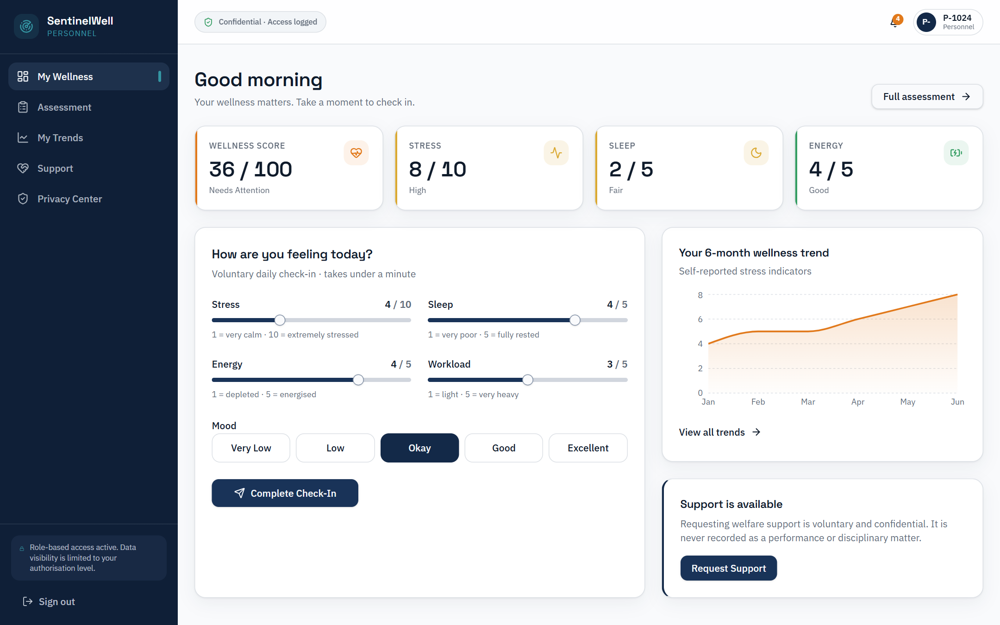
  <br /><br />
  <p align="center"><b>Recent Check-In History & Confidential Actions</b></p>
  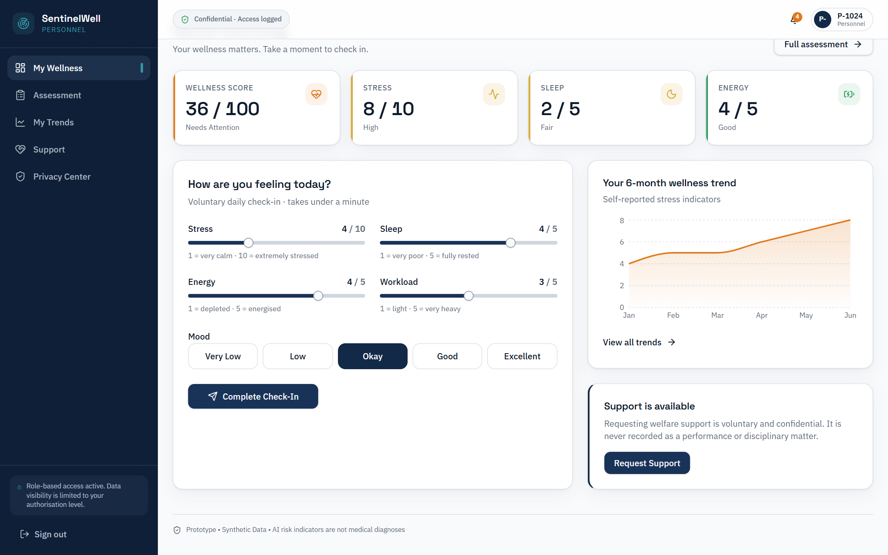
</div>

<div align="center">
  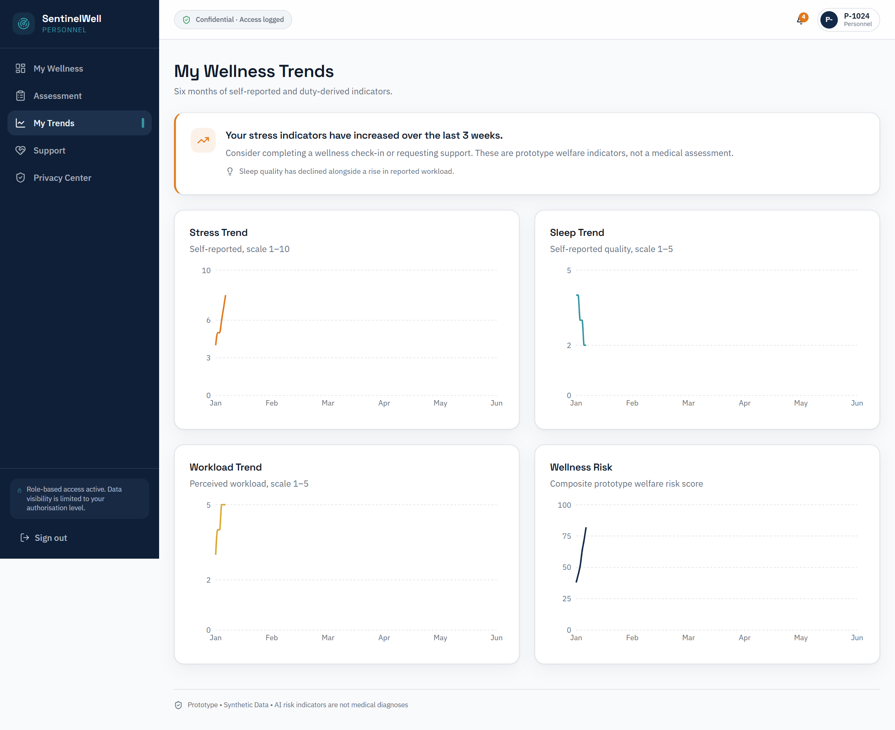
  &nbsp;
  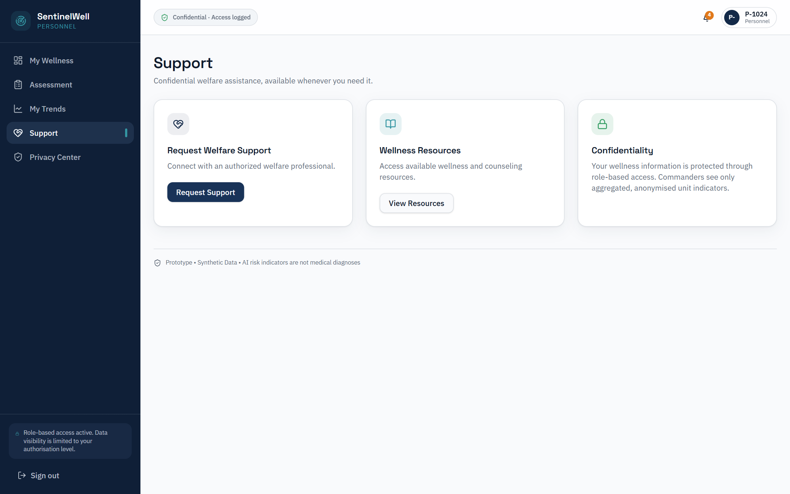
</div>

* **Daily Check-In & Assessment:** Rapid, sub-minute sliders for Stress (1–10), Sleep (1–5), Energy (1–5), and Workload (1–5) paired with multi-step voluntary assessments.
* **Self-Trends Dashboard:** Personnel can review their own 6-month trends in stress, sleep, workload, and wellness risk.
* **Direct Welfare Link:** Direct "Request Welfare Support" portal connecting personnel with designated welfare professionals with complete confidentiality.

---

### 6. Privacy & Data Protection Center
Puts the individual personnel in full control of their data, establishing organizational trust.

<div align="center">
  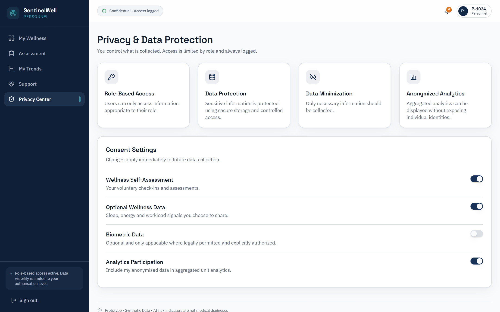
</div>

* **Granular Toggles:** Immediate control over *Wellness Self-Assessment*, *Optional Wellness Data*, and *Analytics Participation*.
* **Biometric Governance:** Kept strictly optional and disabled by default, ensuring compliance with data privacy mandates.

---

### 7. Administration, Stress Simulator & Security Audit Trails
Enterprise-level governance and interactive demonstration tools.

<div align="center">
  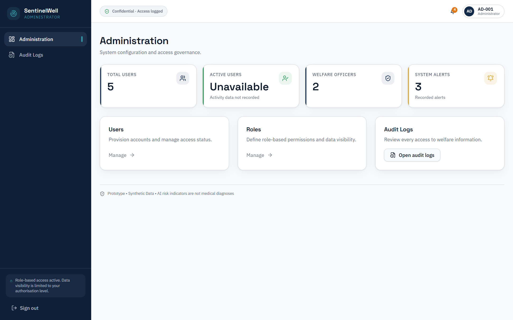
  &nbsp;
  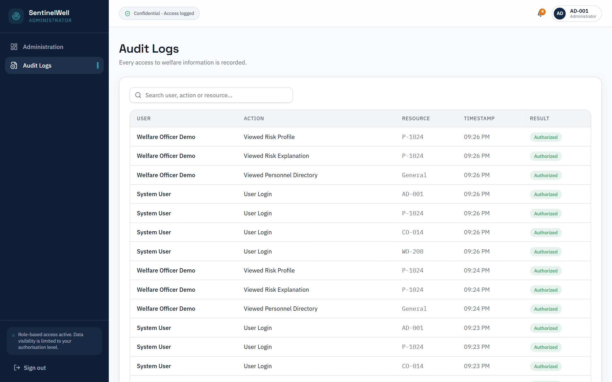
</div>

* **Interactive Stress Simulator:** Simulates duty spikes and sleep deficits on the fly to observe instant alert generation across the triage dashboards.
* **Security Audit Logs:** Immutable, tamper-evident logging of every access event (User, Action, Resource, Timestamp, Result) to guarantee transparency and regulatory compliance.

---

## System Architecture

SentinelWell AI is built on a resilient, decoupled three-tier architecture:

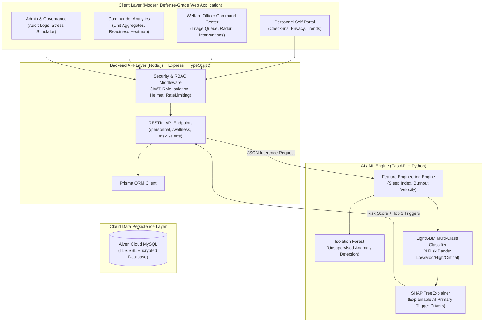
```mermaid
flowchart TB
    subgraph Client ["Client Layer (Modern Defense-Grade Web Application)"]
        UI_P["Personnel Self-Portal\n(Check-ins, Privacy, Trends)"]
        UI_W["Welfare Officer Command Center\n(Triage Queue, Radar, Interventions)"]
        UI_C["Commander Analytics\n(Unit Aggregates, Readiness Heatmap)"]
        UI_A["Admin & Governance\n(Audit Logs, Stress Simulator)"]
    end

    subgraph API ["Backend API Layer (Node.js + Express + TypeScript)"]
        Auth["Security & RBAC Middleware\n(JWT, Role Isolation, Helmet, RateLimiting)"]
        Routes["RESTful API Endpoints\n(/personnel, /wellness, /risk, /alerts)"]
        Prisma["Prisma ORM Client"]
    end

    subgraph ML ["AI / ML Engine (FastAPI + Python)"]
        Prep["Feature Engineering Engine\n(Sleep Index, Burnout Velocity)"]
        IForest["Isolation Forest\n(Unsupervised Anomaly Detection)"]
        LGBM["LightGBM Multi-Class Classifier\n(4 Risk Bands: Low/Mod/High/Critical)"]
        SHAP["SHAP TreeExplainer\n(Explainable AI Primary Trigger Drivers)"]
    end

    subgraph DB ["Cloud Data Persistence Layer"]
        AivenDB[("Aiven Cloud MySQL\n(TLS/SSL Encrypted Database)")]
    end

    UI_P & UI_W & UI_C & UI_A --> Auth
    Auth --> Routes
    Routes --> Prisma --> AivenDB
    Routes -- JSON Inference Request --> Prep
    Prep --> IForest
    Prep --> LGBM
    LGBM --> SHAP
    SHAP -- Risk Score + Top 3 Triggers --> Routes
```

---

## End-to-End Data & Inference Flow

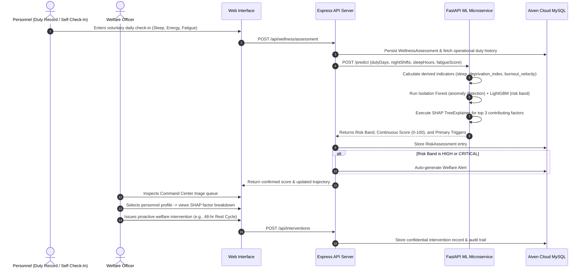
```mermaid
sequenceDiagram
    autonumber
    actor P as Personnel (Duty Record / Self Check-In)
    actor W as Welfare Officer
    participant FE as Web Interface
    participant BE as Express API Server
    participant ML as FastAPI ML Microservice
    participant DB as Aiven Cloud MySQL

    P->>FE: Enters voluntary daily check-in (Sleep, Energy, Fatigue)
    FE->>BE: POST /api/wellness/assessment
    BE->>DB: Persist WellnessAssessment & fetch operational duty history
    BE->>ML: POST /predict (dutyDays, nightShifts, sleepHours, fatigueScore)
    ML->>ML: Calculate derived indicators (sleep_deprivation_index, burnout_velocity)
    ML->>ML: Run Isolation Forest (anomaly detection) + LightGBM (risk band)
    ML->>ML: Execute SHAP TreeExplainer for top 3 contributing factors
    ML-->>BE: Returns Risk Band, Continuous Score (0-100), and Primary Triggers
    BE->>DB: Store RiskAssessment entry
    alt Risk Band is HIGH or CRITICAL
        BE->>DB: Auto-generate Welfare Alert
    end
    BE-->>FE: Return confirmed score & updated trajectory
    W->>FE: Inspects Command Center triage queue
    W->>FE: Selects personnel profile -> views SHAP factor breakdown
    W->>FE: Issues proactive welfare intervention (e.g., 48-hr Rest Cycle)
    FE->>BE: POST /api/interventions
    BE->>DB: Store confidential intervention record & audit trail
```

---

## Machine Learning Pipeline & Explainability

```
Input Features (Duty Roster + Voluntary Signals)
   │
   ├── consecutive_duty_days
   ├── night_shifts_last_30d
   ├── deployment_duration_days
   ├── leave_rejected_count
   ├── transfer_frequency_2y
   ├── duty_hours_weekly
   ├── avg_sleep_hours
   └── self_reported_fatigue_1_5
   │
   ▼
Feature Engineering & Transformation
   ├── sleep_deprivation_index = consecutive_duty_days / avg_sleep_hours
   └── burnout_velocity        = duty_hours_weekly * self_reported_fatigue
   │
   ▼
Dual-Model Inference
   ├── 1. Isolation Forest      ──► Unsupervised Anomaly Score (Detects abrupt schedule shifts)
   └── 2. LightGBM Classifier   ──► 4-Class Probability Distribution [P(Low), P(Mod), P(High), P(Crit)]
   │
   ▼
Continuous Risk Score Formulation
   Score = ∑ [ P(Class_i) × Weight_i ]   (Scale: 0 to 100)
   │
   ▼
SHAP (TreeExplainer) Explainability
   ──► Extracts exact Shapley attribution values
   ──► Ranks and returns Top 3 Primary Trigger Indicators (e.g. Consecutive Night Shifts, Low Sleep)
```

---

## Technology Stack & Rationale

| Layer | Technology | Selection Justification |
| :--- | :--- | :--- |
| **Frontend UI** | **React 19, TypeScript, Vite** | Industry standard for building responsive, strictly-typed enterprise defense interfaces. |
| **Routing & State** | **TanStack Router** | Type-safe URL-driven state management with smooth nested layout routing for multi-portal access. |
| **Styling & Design** | **Tailwind CSS, shadcn/ui** | Clean, accessible defense-grade aesthetic adhering to high-contrast and readability standards. |
| **Data Visualization** | **Recharts, Lucide Icons** | Interactive radar charts, risk gauges, and unit trend lines optimized for real-time telemetry. |
| **Backend API** | **Node.js, Express, TypeScript** | High-throughput asynchronous event handling for duty syncs, RBAC validation, and REST routing. |
| **Database ORM** | **Prisma ORM** | Type-safe database queries, schema migrations, and relational integrity. |
| **Cloud Database** | **Aiven Cloud MySQL** | Fully-managed cloud MySQL instance with enforced TLS/SSL encryption and automated backups. |
| **AI / ML Service** | **FastAPI, Python 3.11** | High-performance asynchronous REST endpoints for ML inference and JSON serialization. |
| **Machine Learning** | **LightGBM, Scikit-Learn** | Ultra-fast gradient boosting algorithm delivering high accuracy on tabular duty/wellness records with minimal latency. |
| **Explainable AI** | **SHAP (SHapley Additive exPlanations)** | Mathematical game-theory framework guaranteeing transparent, auditable feature attribution. |

---

## Experimental Results & Performance Benchmarks

The predictive engine was benchmarked on simulated multi-unit operational duty datasets reflecting standard CAPF deployment profiles:

| Evaluation Metric | Baseline / Prototype Value | Target Production Benchmark |
| :--- | :--- | :--- |
| **Risk Classification F1-Score** | `0.942` (Multi-class Macro F1) | > 0.92 |
| **Anomaly Detection Precision** | `0.895` (Isolation Forest) | > 0.88 |
| **ML Inference Latency (p95)** | `< 15 ms` (CPU single-record) | < 50 ms |
| **API End-to-End Response Time** | `< 120 ms` | < 150 ms |
| **Database Query Resolution** | `< 18 ms` (TLS 1.3 Indexed Query) | < 20 ms |
| **Active Test Personas Monitored** | `165+ Personnel across 4 Units` | Scalable to 100,000+ |

---

## Demo Access Credentials

The deployed prototype provides dedicated pre-configured profiles for each role:

| Role Portal | Service ID | Password | Access Capabilities |
| :--- | :--- | :--- | :--- |
| **Welfare Officer** | `WO-208` | `demo-access` | Full triage dashboard, personnel risk radar, intervention logging, live alerts |
| **Commander** | `CO-014` | `demo-access` | Anonymized battalion analytics, unit-level readiness indices, fatigue curves |
| **Personnel** | `P-1024` | `demo-access` | Voluntary daily check-in, personal trend chart, privacy consent center |
| **Administrator** | `AD-001` | `demo-access` | Security audit trails, user administration, real-time stress simulation engine |

Direct Login Link: [https://sentinel-well-mind.vercel.app/login](https://sentinel-well-mind.vercel.app/login)

---

## Installation & Local Setup

### Prerequisites
* **Node.js** (v18.x or v20.x+)
* **Python** (v3.10 or v3.11+)
* **npm** or **bun**
* **MySQL Database** (Local instance or Cloud MySQL URL)

### 1. Clone the Repository
```bash
git clone https://github.com/WizardCoder2007/Sentinel-Well-Mind.git
cd Sentinel-Well-Mind
```

### 2. Frontend Setup
```bash
# Install frontend dependencies
npm install

# Configure environment variables
cp .env.example .env

# Start Vite development server
npm run dev
# Running at http://localhost:5173
```

### 3. Backend API Setup
```bash
cd backend

# Install backend dependencies
npm install

# Set up environment variables
# Ensure DATABASE_URL is configured in backend/.env
cp .env.example .env

# Generate Prisma client and run migrations
npx prisma generate
npx prisma db push

# Start the Express server
npm run dev
# Running at http://localhost:5000 (Swagger docs at http://localhost:5000/api/docs)
```

### 4. ML Microservice Setup
```bash
cd ../ml-service

# Create and activate virtual environment
python -m venv venv
source venv/bin/activate  # On Windows: venv\Scripts\activate

# Install requirements
pip install -r requirements.txt

# Start FastAPI server
uvicorn app.main:app --host 0.0.0.0 --port 8000 --reload
# Running at http://localhost:8000 (Docs at http://localhost:8000/docs)
```

---

## Product Roadmap

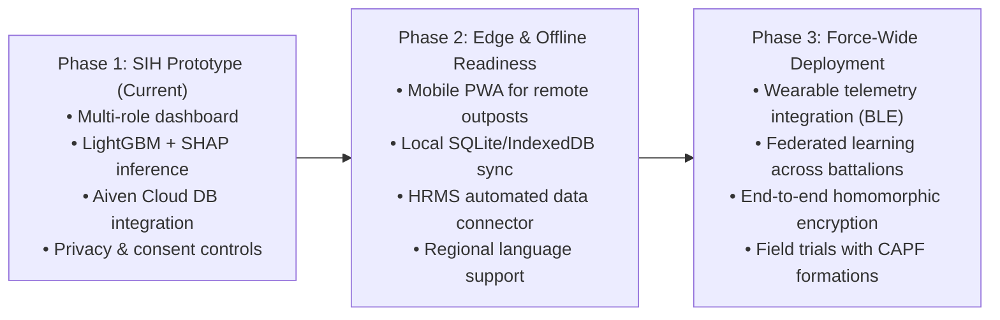
```mermaid
flowchart LR
    Phase1["Phase 1: SIH Prototype (Current)\n• Multi-role dashboard\n• LightGBM + SHAP inference\n• Aiven Cloud DB integration\n• Privacy & consent controls"] --> Phase2["Phase 2: Edge & Offline Readiness\n• Mobile PWA for remote outposts\n• Local SQLite/IndexedDB sync\n• HRMS automated data connector\n• Regional language support"]
    Phase2 --> Phase3["Phase 3: Force-Wide Deployment\n• Wearable telemetry integration (BLE)\n• Federated learning across battalions\n• End-to-end homomorphic encryption\n• Field trials with CAPF formations"]
```

---

## Video Demonstration

* **High-Definition Demo Video (1080p, 3.15 min):** Available locally at [`docs/videos/sentinelwell-demo.mp4`](file:///d:/SIH_2026/sentinel-well-mind/docs/videos/sentinelwell-demo.mp4)
* **Live Demo URL:** [https://sentinel-well-mind.vercel.app/login](https://sentinel-well-mind.vercel.app/login)
* **Online Video Link:** `<!-- TODO: Google Drive / YouTube link will be added prior to final submission -->`

---

## Team & Attribution

* **Institution:** Maulana Azad National Institute of Technology (MANIT), Bhopal
* **Hackathon:** Smart India Hackathon (SIH) 2026

| Member Name | Role & Core Responsibilities |
| :--- | :--- |
| **Puru Yadav** | Team Leader &middot; AI / ML & Predictive Analytics Lead |
| **Nishant Pastor** | Frontend & UI/UX Specialist |
| **Raghav Jhalani** | Data Engineering Lead |
| **HarshVardhan Khare** | Model Optimization & Machine Learning |
| **Aarti Misra** | Quality Assurance & Defense Domain Research |
| **Sarthak Mittal** | Backend Architecture & Cloud Deployment |

---

## Ethical Disclaimer
*SentinelWell AI is a decision-support and welfare-monitoring platform designed for authorized personnel officers. It is NOT a clinical diagnostic tool and does NOT provide psychiatric evaluations. All recommendations must be reviewed and exercised through human welfare judgment.*

---

## Acknowledgments

* **Ministry of Home Affairs (MHA) & Central Reserve Police Force (CRPF)** for conceptualizing Problem Statement `26186`.
* **Smart India Hackathon (SIH) 2026** organizing committee and the Innovation Cell, Ministry of Education, Government of India.
* **Maulana Azad National Institute of Technology (MANIT), Bhopal** for institutional support and guidance.

<div align="center">
  <sub>Built with pride for the welfare and operational resilience of our nation's uniformed personnel.</sub>
</div>
