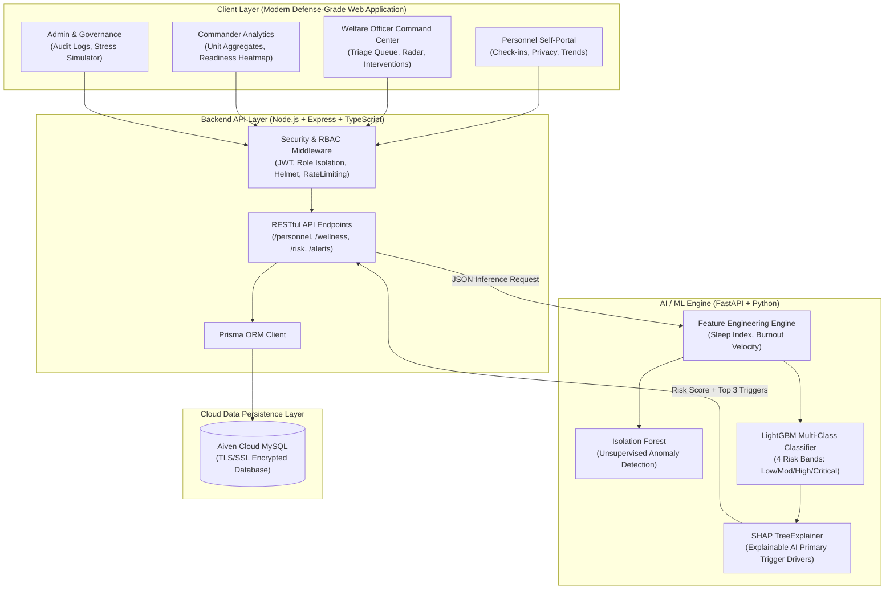
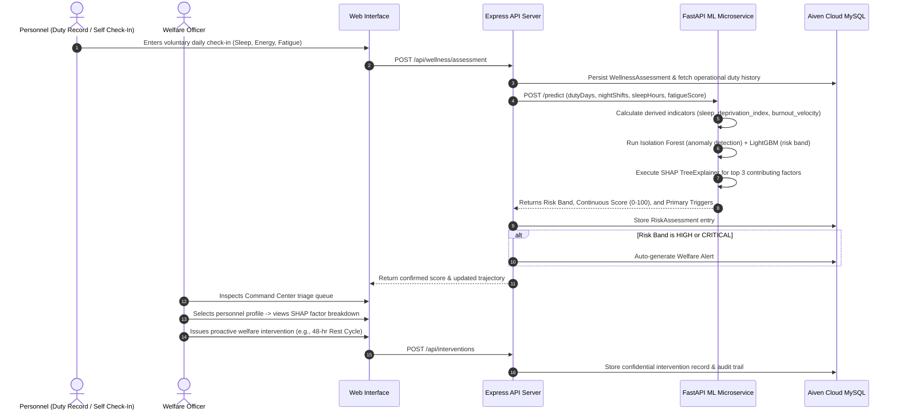
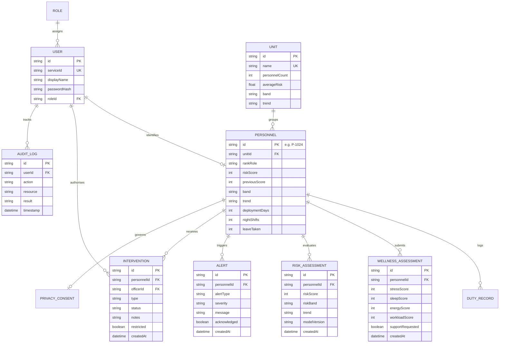
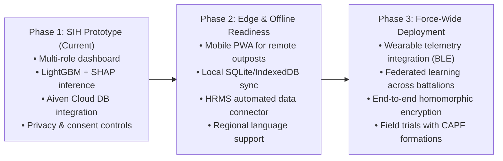

# SentinelWell AI — Technical Specification & Architecture Whitepaper
**Document Version:** 1.0.0-PROTOTYPE  
**Smart India Hackathon (SIH) 2026** | **Problem Statement ID: 26186**  
**Issuing Organization:** Ministry of Home Affairs (MHA), Central Reserve Police Force (CRPF)  
**Target Formations:** Central Armed Police Forces (CRPF, BSF, CISF, ITBP, SSB), Armed Forces, State Police Organisations  
**Engineering Team:** Maulana Azad National Institute of Technology (MANIT), Bhopal

---

## 1. System Overview & Problem Statement Context

Uniformed personnel serving in **Central Armed Police Forces (CRPF, BSF, CISF, ITBP, SSB)**, the **Indian Armed Forces**, and **State Police forces** face rigorous operational conditions—hazardous duty, prolonged postings away from families, disrupted circadian rhythms, and recurring night deployments.

Conventional stress identification across uniformed security organizations remains fundamentally reactive, relying on lagging peer observation after critical psychological burnout or disciplinary incidents manifest. **SentinelWell AI** transforms this operational paradigm from **reactive intervention to proactive prevention**.

By integrating non-invasive, objective operational duty indicators (consecutive duty days, night shift cycles, deployment duration, leave denial patterns) with voluntary self-reported wellness check-ins, our platform computes a 4-band **Welfare Risk Index** backed by **Explainable AI (TreeExplainer SHAP)**. It empowers welfare officers to initiate timely rest cycles and counseling while strictly safeguarding personnel confidentiality and ensuring zero punitive surveillance.

---

## 2. Distributed System Topology & Architecture

SentinelWell AI implements a distributed, service-oriented architecture designed to decouple user-facing telemetry collection from high-throughput predictive risk scoring.

### 2.1 End-to-End Data & Inference Flow

### Core Architecture Principles:
1. **Separation of Concerns:** Client rendering, business logic persistence, and high-intensity mathematical machine learning inference reside on independent tiers.
2. **Role-Based Air-Gapping:** Cryptographic JWT tokens verify claims at the API Gateway before database or inference calls are processed, enforcing role boundaries at the network edge.
3. **Low-Latency Inference:** The FastAPI ML microservice processes tabular feature vectors in sub-15ms execution time, enabling instant recalculation upon check-in submission.

---

## 3. Mathematical Formulation & Feature Space

The prediction engine ingests 8 primary attributes categorized into administrative duty parameters and voluntary wellness telemetry:

### 3.1 Feature Vector Formulation

| Feature Identifier | Type | Range / Domain | Operational Meaning |
| :--- | :--- | :--- | :--- |
| $x_1$: `consecutive_duty_days` | Float | $[0, \infty)$ | Continuous operational duty days without a 24-hr rest window |
| $x_2$: `night_shifts_last_30d` | Float | $[0, 30]$ | Night watch/sentry duties logged during 2200–0600 hrs in past 30 days |
| $x_3$: `deployment_duration_days` | Float | $[0, \infty)$ | Cumulative days deployed at high-strain forward outpost |
| $x_4$: `leave_rejected_count` | Float | $[0, \infty)$ | Number of formal leave requests unapproved or deferred in past 12 months |
| $x_5$: `transfer_frequency_2y` | Float | $[0, \infty)$ | Battalion or company reassignment frequency across past 24 months |
| $x_6$: `duty_hours_weekly` | Float | $[0, 168]$ | Aggregated duty hours on active roster during a 7-day period |
| $x_7$: `avg_sleep_hours` | Float | $(0, 24]$ | Self-reported average sleep duration per 24-hr cycle |
| $x_8$: `self_reported_fatigue_1_5` | Integer | $[1, 5]$ | Subjective exhaustion scale ($1 = \text{Fresh}, 5 = \text{Severe Exhaustion}$) |

### 3.2 Derived Fatigue Variables
To model non-linear physiological strain and cumulative wear, two derived variables are calculated prior to inference:

1. **Sleep Deprivation Index ($SDI$):**
   $$SDI = \frac{x_1}{x_7} = \frac{\text{consecutive\_duty\_days}}{\text{avg\_sleep\_hours}}$$

2. **Burnout Velocity ($BV$):**
   $$BV = x_6 \times x_8 = \text{duty\_hours\_weekly} \times \text{self\_reported\_fatigue}$$

---

## 4. Dual-Model Machine Learning Engine & Explainable AI (XAI)

### 4.1 Anomaly Scoring via Isolation Forest
An **Isolation Forest** model trained on historical duty baselines evaluates the augmented feature vector to quantify outlier operational duty assignments:
$$s_{\text{iso}} = -\text{Score}_{\text{iso}}([x_1, x_2, \dots, x_8, SDI, BV]) \in [-0.5, 0.5]$$
$$X_{\text{augmented}} = [x_1, x_2, \dots, x_8, SDI, BV, s_{\text{iso}}]$$

### 4.2 Multi-Class Risk Classification (LightGBM)
The LightGBM classifier evaluates the 11-dimensional vector $X_{\text{augmented}}$ to generate a calibrated probability distribution across 4 welfare risk tiers:
$$P = [p_{\text{Low}}, p_{\text{Mod}}, p_{\text{High}}, p_{\text{Crit}}] \quad \text{where } \sum_{k=0}^{3} p_k = 1$$
* **Low ($k=0$):** Baseline operational readiness; normal recovery.
* **Moderate ($k=1$):** Emerging fatigue markers; monitored duty cycles.
* **High ($k=2$):** Significant fatigue/stress accumulation; rest adjustment recommended.
* **Critical ($k=3$):** Severe burnout indicators; proactive welfare intervention required.

### 4.3 Continuous 0–100 Welfare Risk Formulation
To eliminate discrete step-function jumps in longitudinal tracking, a continuous risk score $S \in [0, 100]$ is computed as the inner product of class probabilities with class centroid weights:
$$S = \text{round}\left( \sum_{k=0}^{3} p_k \times w_k \right) \quad \text{with centroid vector } W = [0, 33.33, 66.67, 100.00]$$

### 4.4 Explainable AI (XAI) via TreeExplainer SHAP
To eliminate algorithmic black-box opacity and build trust with military commanders, the system calculates exact Shapley values $\phi_i$ for each feature $i \in \{1, \dots, 11\}$ with respect to predicted class $\hat{y}$:
$$\phi_i(\hat{y}) = \sum_{S \subseteq F \setminus \{i\}} \frac{|S|!(|F| - |S| - 1)!}{|F|!} \left[ f(S \cup \{i\}) - f(S) \right]$$
$$\text{Primary Triggers} = \text{top\_3}\left( \arg\sort_{i} |\phi_i| \right)$$
These top 3 factors are translated into transparent operational triggers (e.g. *14 Consecutive Duty Days*, *8 Night Shifts in 30 Days*, *Under 5 Hours Average Sleep*) presented directly to welfare officers.

---

## 5. Comprehensive Module Specifications & UI Walkthrough

SentinelWell AI comprises 7 distinct operational modules engineered to fulfill defense-grade usability, data isolation, and human-in-the-loop triage:

### Module 1: Welfare Officer Command Center & Real-Time Triage
The Welfare Officer Command Center serves as the primary tactical dashboard for authorized welfare professionals. It aggregates force-wide welfare indicators while providing an actionable roster for individuals in need of rest or counseling.

*Figure 1: Welfare Officer Command Center showing macro distributions (165 Monitored, 90 High Risk, 30 Critical) and longitudinal 6-month historical risk distribution trends.*

*Figure 2: High-Risk Personnel Master Triage Table detailing Personnel IDs (`P-1133`, `P-1031`, `P-1078`, `P-1179`, `P-1042`, `P-1024`), numerical risk scores, trajectory trends, and direct triage action buttons.*

* **Key Functional Capabilities:**
  * **Macro Welfare KPIs:** Real-time headcount across risk bands (`Low`, `Moderate`, `High`, `Critical`).
  * **Unit Wellness Overview:** Comparative snapshot cards for Unit A (Low - 31), Unit B (Moderate - 54), Unit C (High - 71), and Unit D (Low - 27).
  * **Triage Master Table:** Prioritized by severity, highlighting operational drivers (e.g., *Prolonged deployment, Severe sleep deficit*).

---

### Module 2: Personnel Risk Radar & Explainable AI (XAI)
Provides a deep, explainable inspection view for any selected personnel record, presenting the mathematical breakdown of their risk score without stigmatizing diagnostic labels.

*Figure 3: Personnel Risk Radar (P-1024) featuring 0–100 continuous risk gauge (64 High) and normalized SHAP factor attribution bars (Reported Workload 100%, Night Shifts 88%, Duty Hours 85%, Deployment Duration 82%).*

*Figure 4: Longitudinal 6-Month Telemetry Curves (Stress, Sleep, Workload, Duty Hours) alongside the Recommended Welfare Actions triage hub.*

* **Key Functional Capabilities:**
  * **Continuous Risk Gauge:** Visualizes score, risk category, and deltas from prior evaluation (`↘ 18 pts from previous assessment`).
  * **Relative Factor Attribution:** Transparent bars detailing the primary operational stressors contributing to the score.
  * **Longitudinal Telemetry Graphs:** Multi-month curves tracking Stress, Sleep Quality, Perceived Workload, and Monthly Duty Hours (200h $\rightarrow$ 260h).
  * **Human-in-the-Loop Action Hub:** Dedicated one-click workflows:
    * *Confidential welfare follow-up* (Schedule private conversation)
    * *Review recent duty workload* (Adjust rotation cycles)
    * *Consider rest/rotation where operationally feasible*
    * *Offer available counselling and wellness resources*
    * *Schedule follow-up assessment within 7 days*

---

### Module 3: Proactive Welfare Interventions & Live Alert Stream
Enables welfare officers to transition directly from risk detection to formalized organizational care.

*Figure 5: Structured Welfare Interventions Management Table tracking personnel ID, intervention type, assigned officer, date, status, and confidential notes.*

*Figure 6: Live Welfare Alert Stream highlighting automated alert detections such as Excessive Workload and Increasing Fatigue Trend.*

* **Key Functional Capabilities:**
  * **Automated Alert Generation:** Emits alerts when duty hours exceed unit averages or sleep deficit persists across multiple assessment windows.
  * **Intervention Lifecycle:** Tracks actions through stages: `Pending`, `In Progress`, `Completed`, `Follow-up Required`.
  * **Confidential Case Notes:** Protected intervention details viewable only by authorized welfare caseworkers.

---

### Module 4: Commander Battalion Overview & Operational Analytics
Engineered specifically for battalion commanders, senior leadership, and headquarters planners. It provides operational readiness metrics while enforcing an air-gap that blocks access to individual personal profiles.

*Figure 7: Commander Battalion Overview displaying overall force readiness, unit wellness index, and comparative monthly duty workload curves.*

*Figure 8: Battalion Fatigue Indicators (recorded night shifts mapped against monthly duty hours) and automated operational duty recommendations.*

*Figure 9: Commander Unit Analytics detailing deployment duration distributions (>90–150 days) versus average leave days utilized across battalions.*

* **Key Functional Capabilities:**
  * **Anonymized Unit Readiness:** Displays company-level aggregated burnout scores without exposing individual medical or personal data.
  * **Workload vs. Leave Correlation:** Correlates high deployment cycles with unutilized leave balances.
  * **Operational Welfare Insights:** Automated recommendations (e.g., *"Unit C has the highest current average risk at 71. Recommendation: Review duty distribution for Unit C"*).

---

### Module 5: Personnel Self-Check-In, Self-Trends & Support Portal
A voluntary, confidential mobile-responsive portal designed for jawans and ground officers.

*Figure 10: Personnel Wellness Dashboard featuring rapid, sub-minute daily check-in sliders (Stress, Sleep, Energy, Workload).*

*Figure 11: Personnel Assessment Roster and direct confidential action cards.*

*Figure 12: Personnel Self-Trends Telemetry Graphs tracking individual multi-month trajectories in stress, sleep, and workload.*

*Figure 13: Direct "Request Welfare Support" portal connecting personnel with designated welfare professionals with complete confidentiality.*

* **Key Functional Capabilities:**
  * **Sub-Minute Check-Ins:** Intuitive sliders for Stress (1–10), Sleep (1–5), Energy (1–5), and Workload (1–5).
  * **Personal Longitudinal Telemetry:** Jawans can inspect their own historical progress over 6 months to maintain self-awareness.
  * **Direct Welfare Link:** Direct, un-intercepted communication channel to request a confidential counseling session.

---

### Module 6: Privacy, Governance & Consent Controls
Puts the individual personnel in full control of their data, establishing organizational trust.

*Figure 14: Dedicated Privacy & Data Protection Center with granular toggles for self-assessments, optional wellness data, and analytics.*

* **Key Functional Capabilities:**
  * **Granular Consent Controls:** Direct user toggles for *Wellness Self-Assessment*, *Optional Wellness Data*, and *Analytics Participation*.
  * **Zero Biometrics Default:** Biometric ingestion is strictly optional, uncollected, and disabled by default in full compliance with defense privacy guidelines.
  * **Transparency by Design:** Explains data protection protocols and role-based isolation guarantees.

---

### Module 7: System Administration, Stress Simulator & Security Audit Trails
Enterprise-level governance and interactive demonstration tools.

*Figure 15: Interactive Stress Simulator demonstrating end-to-end alert propagation upon parameter injection (increasing workload, sleep deficit, night shifts).*

*Figure 16: Immutable Security Audit Register displaying timestamped user sessions, resource targets, and authorization results.*

* **Key Functional Capabilities:**
  * **Interactive Stress Simulator:** Injects synthetic operational strain on the fly to demonstrate live alert propagation across dashboards for hackathon evaluation.
  * **Immutable Audit Trail:** Append-only logging of every single access event (User, Action, Resource, Timestamp, Result) to guarantee transparency and regulatory compliance.

---

## 6. Database Relational Schema & Persistence Architecture

The persistence layer is modeled in Prisma ORM and hosted on an encrypted **Aiven Cloud MySQL** cluster.

---

## 7. Security Architecture & Role-Based Air-Gapping (RBAC)

SentinelWell enforces strict Role-Based Access Control at the API middleware layer:

| Method | API Endpoint | Authorized Roles | Function |
| :--- | :--- | :--- | :--- |
| `POST` | `/api/auth/login` | Public | Signs and returns signed JWT access + refresh tokens |
| `GET` | `/api/health` | Public | Live database connectivity and ML microservice ping check |
| `GET` | `/api/personnel` | Welfare Officer, Admin | Fetches prioritized welfare triage queue |
| `GET` | `/api/personnel/:id` | Welfare Officer, Admin | Retrieves individual risk radar & SHAP triggers |
| `POST` | `/api/wellness/assessment` | Personnel | Records voluntary check-in; invokes ML engine |
| `GET` | `/api/alerts` | Welfare Officer, Admin | Streams active welfare alerts awaiting officer review |
| `POST` | `/api/interventions` | Welfare Officer | Records a new supportive action (rest cycle, roster rotation) |
| `GET` | `/api/analytics/command` | Commander, Admin | Fetches aggregated battalion readiness and fatigue curves |
| `GET` | `/api/privacy/consent` | Personnel | Retrieves current data consent and telemetry opt-in settings |
| `POST` | `/api/simulation/stress` | Administrator | Injects synthetic operational strain to demonstrate live alert propagation |

---

## 8. Deployment Topology & Environments

* **Frontend Client:** Deployed on **Vercel** CDN edge infrastructure.
* **Backend API Gateway:** Containerized Node.js service running on **Render Cloud Services**.
* **AI/ML Engine:** FastAPI microservice running on **Render** with Python 3.11 runtime.
* **Database:** **Aiven Cloud MySQL** cluster (Singapore region) with TLS 1.3 encryption.

---

## 9. Product & Operational Roadmap

---

## 10. Engineering Team Attribution — MANIT Bhopal

| Member Name | Role & Core Engineering Responsibilities |
| :--- | :--- |
| **Puru Yadav** | Team Leader &middot; AI / ML & Predictive Analytics Lead |
| **Nishant Pastor** | Frontend Architecture & UI/UX Specialist |
| **Raghav Jhalani** | Data Engineering & Pipeline Architecture |
| **HarshVardhan Khare** | Model Optimization & Machine Learning Benchmarking |
| **Aarti Misra** | Quality Assurance & Defense Domain Research |
| **Sarthak Mittal** | Backend Architecture & Cloud Deployment |
